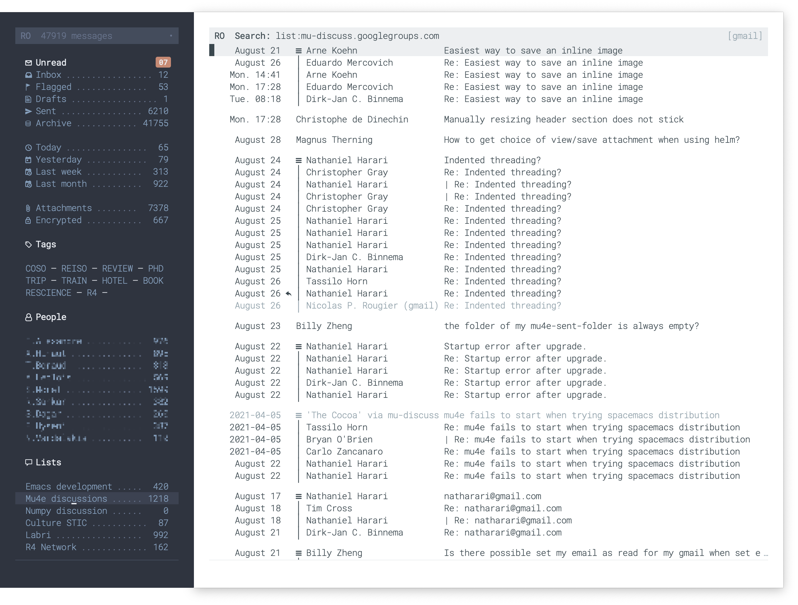

Sideframe is a package for creating sideframes that are glued to another
parent frame. This can be used to display a menu or a dashboard for example.
If you want to maximize a frame that has sideframes, use the
`sideframe-toggle-maximized` function that computes the size properly.




**Usage example**:

```lisp
(sideframe-make 'left  32)
(sideframe-make 'right 32)
(sideframe-toggle-maximized)
```

If you're using a theme that has both dark and light modes, you can also assign
 a different mode to the side frame (here with [nano theme](https://github.com/rougier/nano-theme)):

```lisp
(sideframe-make 'left 32 'dark `((foreground-color . ,nano-dark-foreground)
                                 (background-color . ,nano-dark-background)))
```

